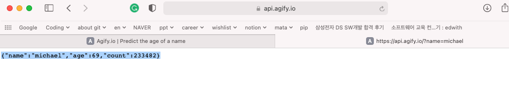
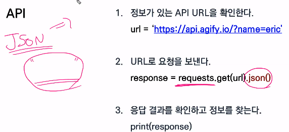

### 1. JSON(JavaScript Object Notation)

`데이터만을` 주고 받기 위한 표기법

dictionary 처럼 보이지만 사실 JSON이다.

문자열인 JSON을 dictionary와 list 형태로 바꿔줌.

### 2. API란?

* 응용 프로그램에서 사용할 수 있도록, 운영 체제나 프로그래밍 언어가 제공하는 기능을 제어할 수 있게 만든 인터페이스. 
* 어떠한 운영체제를 사용하도 동일한 결과값을 받아 볼수 있음.

#### API 사용의 핵심

* 서버에서 확인 할 수 있게끔 요청을 보내야함.

  