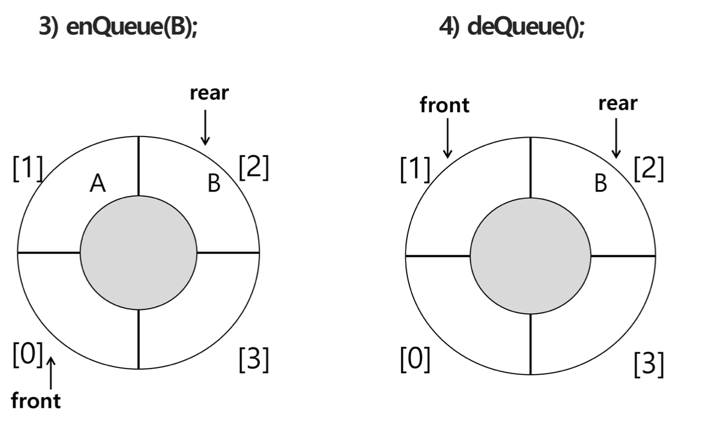
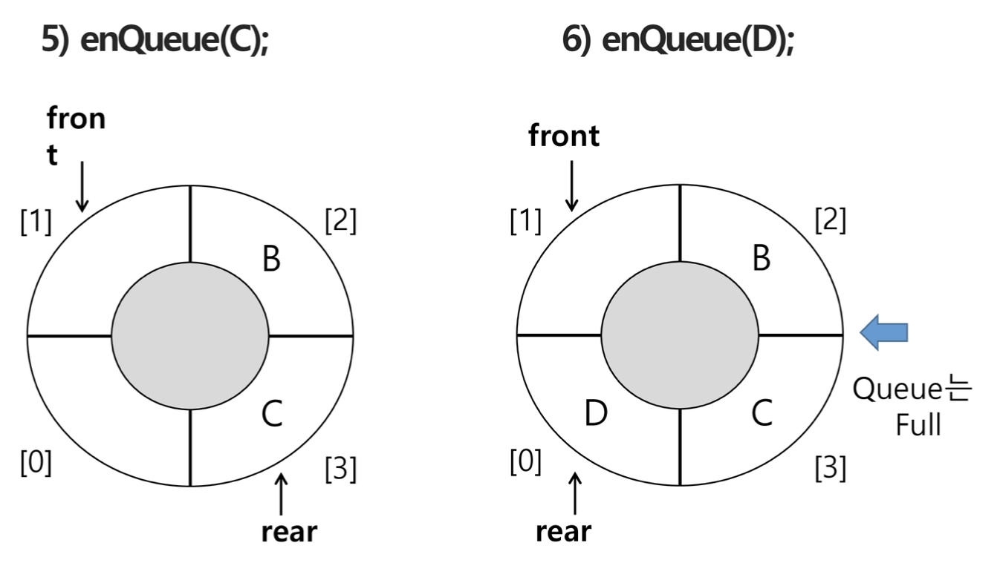

# Queue

### Queue의 특성

* 스택과 마찬가지로 삽입과 삭제의 위치가 제한적인 자료 구조
* 선입선출구조(FIFO : First In First Out)
  * 큐에 삽입한 순서대로 원소가 저장, 가장 먼저 삽인 된 원소는 가장 먼저 삭제
* 큐의 기본 연산
  * 삽입 : enQueue
  * 삭제 : deQueue


#### Queue의 주요 연산

| 연산          | 기능                                               |
| ------------- | -------------------------------------------------- |
| enQueue(item) | 큐의 뒤쪽(rear 다음)에 원소를 삽입하는 연산        |
| deQueue()     | 큐의 앞쪽(front)에서 원소를 삭제하고 반환하는 연산 |
| createQueue() | 공백 상태의 큐를 생성하는 연산                     |
| isEmpty()     | 큐가 공백상태인지를 확인하는 연산                  |
| isFull()      | 큐가 포화상태인지를 확인하는 연산                  |
| Qpeek()       | 큐의 앞쪽(front)에서 원소를 삭제없이 반환하는 연산 |

#### 

#### Queue의 연산 과정

* front :
* rear :

1. 공백 큐 생성 : createQueue();

   front = rear = -1

   

2. 원소 A 삽입 : enQueue(A);

   front = -1; Q[rear] = A

   

3. 원소 B 삽입 : enQueue(B);

   front = -1; Q[rear]B

   

4. 원소 반환/삭제 : deQueue();

   front += 1; A 꺼낸다.

   

5. 원소 C 삽입 : enQueue(C);

   front = 0

   rear += 1; Q[rear] = C

   

6. 원소 반환/삭제 : deQueue();

   front += 1; B 꺼낸다.

   

7. 원소 반환/삭제 : deQueue();

   front += 1; C 꺼낸다.

   ※ front == rear : Q에 있는 모든 데이터가 꺼내진 상태

   

#### 

### Queue의 구현

#### 1. 선형 큐

* 1차원 배열을 이용
  * 큐의 크기 = 배열의 크기
  * front : 저장된 첫 번째 원소의 인덱스
  * reaer : 저장된 마지막 원소의 인덱스
* 상태 표현
  * 초기 상태 : front = rear = -1
  * 공백 상태 : front = rear
  * 포화 상태 : rear = n-1 (n: 배열의 크기, n-1 : 배열의 마지막 인덱스)
    * 포화 상태에서 삽입 => overflow

#### 초기 공백 큐 생성

* 크기 n인 1차원 배열 생성
* front와 rear를 -1로 초기화


##### 삽입 : enQueue(item)

* 마지막 원소 뒤에 새로운 원소 삽입하기 위해

  * rear값을 하나 증가시켜 새로운 원소를 삽입할 자리 마련
  * 그 인덱스에 해당하는 배열원소 Q[rear]에 item 저장

  ```python
  def enQueue(item) : 
    global rear
    if isFull() : print("Queue_full")
    else:
      rear += 1
      Q[rear] = item;
  ```

  

##### 삭제 : deQueue()

* 가장 앞에 있는 원소를 삭제하기 위해

  * front값을 하나 증가시켜 큐에 남아 있게 될 첫 번째 원소 이동
  * 새로운 첫 번째 원소를 리턴 함으로써 삭제와 동일한 기능

  ```python
  def deQueue() : 
    if(isEmpty()) then Queue_Empty():
    else:
      front += 1
      return Q[front]
  ```

  

##### 공백 및 포화상태 검사 : isEmpty(), isFull()

* 공백 상태 : front = rear

* 포화 상태 : rear = n-1 (n배열 크기)

  ```python
  def isEmpty():
    return front == rear
  
  def Full():
    return rear = len(Q) - 1
  ```

  

##### 검색 : Qpeek()

* 가장 앞에 있는 원소를 검색하여 반환하는 연산

* 현재 front의 한자리 뒤(front+1)에 있는 원소, 즉 큐의 첫번째에 있는 원소를 반환

  ```python
  def Qpeek():
    if isEmpty() : print("Queue_Empty")
    else:
      return Q[front+1]
  ```

  

#### 선형 큐 이용시 문제점

* 잘못된 포화상태 인식 

  * 배열의 앞부분에 활용할 수 있는 공간이 있음에도, rear=n-1인 상태, 즉 포화 상태로 인식하여 더이상 삽입 수행하지 않게 됨

    

* 해결방법 1

  * 매 연산이 이루어질때마다 저장된 원소들을 배열의 앞부분으로 매우이동 => 효율성 급격히 떨어짐

* 해결방법 2

  * 1차원 배열을 사용하된되, 논리적으로 배열의 처음과 끝이 연결되어 원형 상태의 큐를 이룬다고 가정하고 사용

    


### 2. 원형 큐의 구조

#### 초기 공백 상태

* front = rear = 0


#### Index의 순환

* front와  rear의 위치가 배열의 마지막 인덱스인 n-1를 가리킨 후, 논리적 순환을 이루어 배열의 처음 인덱스인 0으로 이동해야 함
* 이를 위해 나머지 연산자 mod를 사용


#### front 변수

* 공백 상태와 포화 상태 구분을 쉽게 하기 위해 front가 있는 자리는 사용하지 않고 항상 빈자리로 둠

#### 삽입 위치 및 삭제 위치

|         | 삽입 위치               | 삭제 위치                 | 초기화            |
| ------- | ----------------------- | ------------------------- | ----------------- |
| 선형 큐 | rear += 1               | front += 1                | front = rear = -1 |
| 원형 큐 | rear = (rear + 1) mod n | front = (front + 1) mod n | front = rear = 0  |


#### 원형 큐의 구현

##### 초기 공백 큐 생성

* 크기 n인 1차원 배열 생성
* front와 rear를 0으로 초기화


##### 공백 상태 및 포화상태 검사 : isEmpty(), isFull()

* 공백 상태 : front = rear

* 포화 상태 : 삽입할 rear의 다음 위치 = 현재 front

  (rear + 1) mod n = front

```python
def isEmpty():
  return front == rear

def isFull():
  return (rear+1) % len(cQ) == front
```


##### 삽입 : enQueue(item)

* 마지막 원소 뒤에 새로운 원소 삽입하기 위해
  * rear값을 조정하여 새로운 원소를 삽입할 자리 마련 : rear += 1
  * 그 인덱스에 해당하는 배열원소 cQ[rear]에 item을 저장

```python
def enQueue(item):
  global rear
  if isFull():
 		...
  else:
    rear = (rear+1) % len(cQ)
    cQ[rear] = item
```


##### 삭제 : deQueue(), delete()

* 가장 앞에 있는 원소를 삭제하기 위해
  * front값을 조정하여 삭제할 자리 준비
  * 새로운 front원소를 리턴 함으로 삭제와 동일한 기능 함

```python
def deQueue():
  global front
  if isEmpty():
    ...
  else:
    front = (front+1) % len(cQ)
    return cQ[front]
```







### 3. 연결 큐의 구조

#### 단순 연결 리스트(linked list)를 이용한 큐

* 큐의 원소 : 단순 연결 리스트의 노드
* 큐의 원소 순서: 노드의 연결 순서. 링크로 연결 되어 있음
* front :  첫 번째 노드
* rear : 마지막 노드

#### 상태 표현

* 초기 상태 :  front = rear = null
* 공백 상태 : front = rear = null


#### 연결 큐의 연산 과정

1. 공백 큐 생성 : createLinkedQueue()

   front = rear = null

2. 원소 A 삽입 : enQueue(A)

   

3. 원소 B 삽입 : enQueue(B)


4. 원소 삭제 : deQueue()


5. 원소 C 삽입 : enQueue(C)


6. 원소 삭제 : deQueue()


7. 원소 삭제 : deQueue()


##### 공백 상태 검사 : isEmpty()

```python
def isEmpty():
  return front == None
```

##### 삽입 : enQueue(item)

```python
class Node:
    def __init__(self, item, n=None):
        self.item = item
        self.next = n

def enQueue(item):
    global front, rear
    newNode = Node(item) # 새로운 노드 생성
    if isEmpty(): 
        front = newNode
    else:
        rear.next = newNode
    rear = newNode
```

##### 삭제 : deQueue()

* old가 지울 노드를 가리키게 하고, front 재설정
* 삭제 후 공백 큐가 되는 경우, rear도 NOne로 설정
* old가 가리키는 노드 삭제 하고 메모리 반환

```python
def deQueue():
  global front, rear
  if isEmpty():
    return None
  
  item = front.item
  front = front.next
  if isEmpty():
    rear = None
  return item
```

##### 


### 4. 우선순위 큐(Priority Queue)

#### 우선순위 큐의 특성

* 우선순위를 가진 항목들을 저장하는 큐
* FIFO 순서가 아니라 우선순위가 높은 순서대로 먼저 나간다

#### 적용 분야

* 시뮬레이션 시스템
* 네트워크 트래픽 제어
* 운영체제의 테스크 스케줄링


#### 우선순위 큐의 구현

* 배열을 이용한 우선순위 큐
* 리스트를 이용한 우선순위 큐

#### 우선순위 큐의 기본 연산

* 삽입 : enQueue
* 삭제 :  deQueue


#### 배열을 이용한 우선순위 큐

* 배열을 이용하여 자료 저장
* 원소를 삽입하는 과정에서 우선순위를 비교해 적절한 위치에 삽입하는 구조
* 가장 앞에 최고 우선순위의 원소가 위치
* 문제점
  * 배열을 사용하므로 삽입, 삭제 연산이 일어날 때 원소의 재배치가 발생하여 소요시간, 메모리 낭비가 큼


### 큐의 활용 : 버퍼(Buffer)

##### 버퍼

* 데이터를 한곳에서 다른 한곳으로 전송하는 동안 일시적으로 그 데이터를 보관하는 메모리 영역
* 버퍼링 : 버퍼를 활용하는 방식 또는 버퍼를 채우는 동작

##### 버퍼의 자료 구조

* 버퍼는 일반적으로 입출력 및 네트워크와 관련된 기능에서 이용
* 순서대로 입력/출력/전달되야 하므로 FIFO 방식의 자료구조인 큐가 활용된다.


### 마이쮸 연습문제

Queue를 이용해 마이쮸 나눠주기 시뮬레이션을 해보자

1번이 줄을 선다. 1번이 한개의 마이쮸를 받는다.

1번이 다시 줄을 선다. 새로 2번이 들어와 줄을 선다.

1번이 두 개의 마이쮸를 받는다. 1번이 다시 줄을 선다. 새로 3번이 들어와 줄을 선다.

2번이 한 개의 마이쮸를 받는다. 2번이 다시 줄을 선다. 새로 4번이 들어와 줄을 선다.

1번이 세 개의 마이쮸를 받는다. 1번이 다시 줄을 선다. 새로 5번이 들어와 줄을 선다.

3번이 한 개의 마이쮸를 받는다. ... 반복

20개의 마이쮸가 있을 때 누가 가져갈까?


```python
N = 20
q = [(1,0)]
j = 1
last = 0

while N>0:
  i, m = q.pop(0) # 줄의 맨 앞 사람, i번, m이전에 받은 개수
  m += 1 # 이번에 받을 마이쮸 개수
  N -= m	# 남은 마이쮸
  j += 1	# 새로 줄서는 사람 번호
  q.append((i,m))	# 맨 앞사람이 m개 받고 다시 줄을 섬
  q.append((j,0))	# 새로 줄 서는 사람. 마이쮸 0개
  last = i
print(last)
```

