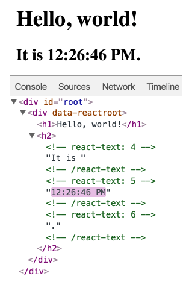
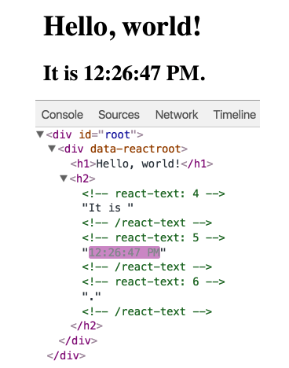

# Rendering Elements

Elements는 React 앱의 가장 작은 단위이다.

Elements는 화면에 표시할 내용을 기술한다.

```jsx
const element = <h1>Hello, world</h1>;
```


브라우저 DOM elements와 달리 React elements들은 일반 객체이며(plain objects) 쉽게 생성할 수 있다. React DOM은 React elements와 일치하도록 DOM을 업데이트 한다.

> Elements는 Components의 구성요소 이다.


### 1. DOM에 엘리먼트 렌더링하기

`<div>`가 HTML 파일에 있다고 해보자,

```jsx
<div id="root"></div>
```

이 안에 들어가는 모든것들을 React DOM으로 관리하기 때문에 이걸  "root" DOM 노드 라고 부른다.

React로 구현된 어플리케이션들은 주로 하나의 root DOM node를 가진다. React를 이미 존재하는 앱에 통합하려는 경우, 원하는 만큼 많은 수의 독립된 root DOM 노드들을 가질 수도 있다.


root DOM node안에 있는 React element를 렌더하기 위해서는, 둘다 `ReactDOM.render()` 로 전달 하면 된다.

```jsx
const element = <h1>Hello, World</h1>;
ReactDOM.render(element, document.getElementyById('root'));
```


위 코드를 실행하면 화면에 "Hello, World"가 보인다.


### 2. 렌더링 된 엘리먼트 업데이트 하기

React element는 불변 객체이다. 엘리먼트를 생성한 이후, 해당 엘리먼트의 자식이나 속성을 변경할 수 없다. 엘리먼트는 영화의 하나의 프레임과 같다: 특정 시점의 UI를 보여준다.

현재까지의 내용으로, UI를 업데이트 하는 유일한 방법은 새로운 엘리먼트를 생성하여 `ReactDOM.render()`로 전달하는 것이다.


예시로 똑딱거리는 시계를 살펴보자

```jsx
function tick() {
  const element = (
  <div>
      <h1>Hello, World!</h1>
      <h2>It is {new Date().toLocaleTimeString()}.</h2>
  </div>
  );
  ReactDOM.render(element, document.getElementsById('root'));
}
setInterval(tick, 1000);
```


`setInterval()` 콜백을 이용해 매 초마다 `ReactDOM.render()`를 호출한다.

> 실제로 대부분의 React앱은 `ReactDOM.render()` 를 한번만 호출한다.


### 3. React Only Updates What's Necessary

React DOM은 해당 엘리먼트와 그 자식 엘리먼트를 이전의 엘리먼트와 비교하고 DOM을 원하는 상태로 만들기 위해 필요한 경우만 DOM을 업데이트한다.


```jsx
function getGreeting(user) {
  if(user) {
    return <h1>Hello, {formatName(user)}!</h1>;
  }
  return <h1>Hello, Stranger.</h1>
}
```


위의 시계 예시를 살펴보자.







매초 전체 UI를 다시 그리도록 엘리먼트를 만들었지만, React DOM은 내용이 변경되는 텍스트 노드만 업데이트 한다.


> 출처 : *https://ko.reacjs.org*
