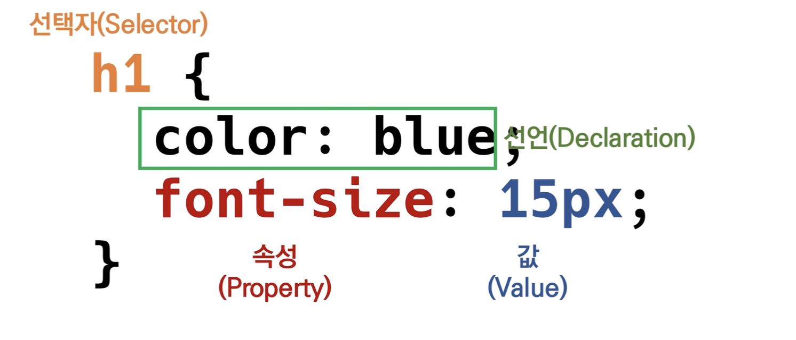
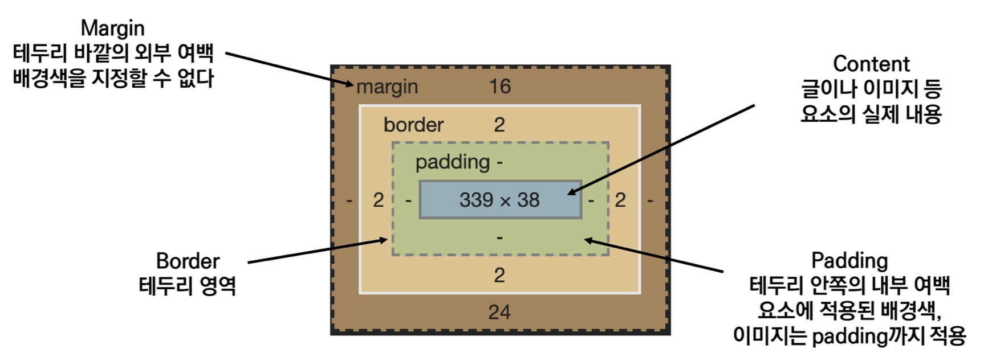
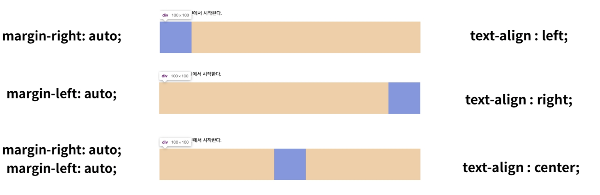

# CSS (Cascading Style Sheets)

* 스타일, 레이아웃을 통해 문서를 표시하는 방법을 지정하는 언어

### CSS 구문

### CSS 정의 방법

1. Inline

2. 내부 참조(embedding) - \<style>

3. 외부 참조(link file) - 분리된 CSS 파일

   

### 선택자

* HTML 문서에는 특정한 요소를 선택하여 스타일링 하기 위해서 반드시 선택자라는 개념이 필요
* 기본 선택자
  * 전체 선택자, 요소 선택자
  * 클래스 선택자, 아이디 선택자, 속성 선택자
* 결합자(Combinators)
  * 자손 결합자, 자식 결합자
  * 일반 형제 결합자, 인접 형제 결합자
* 의사 클래스/요소(pseudo class)
  * 링크, 동적 의사 클래스
  * 구조적 의사 클래스

* \* 전체 선택자 \*{color:red;}
* . class 선택자 ex) .green{color: green;}
* \# id 선택자  #purple{color:red;}       id는 고유한 값 1개만 존재.

### CSS 적용 우선순위 (super important)

1. 중요도(importance) - 사용시 주의

   * !important

     

2. 우선 순위(Specificity)

   * 인라인 > id 선택자 > class 선택자 > 요소 선택자

   

3. 소스 순위

### CSS 상속

* CSS는 상속을 통해 부모 요소의 속성을 자식에세 상속한다. 모두 상속하는것은 아님
  * 속성(프로퍼티) 중에는 상속이 되는 것과 되지 않는 것들이 있다.
  * 상속 되는것 예시
    * text관련 요소(font,color, text-align), opacity,visibility
  * 상속 되지 않는것
    * Box model 관련요소 (width, height, margin, padding, border, box-sizing, display),
    * position 관련요소

### 크기 단위

* px
  * 모니터 해상도의 한 화소인 픽셀을 기준
  * 픽셀의 크기는 변하지 않기 때문에 고정적인 단위
* %
  * 백분율 단위
  * 가변적인 레이아웃에서 자주 사용
* em
  * (바로 위, 부모 요소에 대한)상속의 영향을 받음
  * 배수 단위, 요소에 지정된 사이즈에 상대적인 사이즈를 가짐
* rem
  * 상속의 영향을 받지 않음
  * 최상위 요소(html)의 사이즈를 기준으로 배수 단위를 가짐
* viewport
  * 웹 페이지를 방문한 유저에게 바로 보이게 되는 웹 컨텐츠의 영역
  * 주로 스마트폰이나 테블릿 디바이스의 화변을 일컫는 용어
  * 글자 그대로 디바이스의 viewport를 기준으로 상대적인 사이즈가 결정됨
  * vw, vh, vmin, vmax

### 결합자

* 일반 형제 결합자

  * selector A의 형제요소 중에 뒤에 위치하는 selcetorB 요소를 모두 선택

  ex) p ~ span {color :red;}

* 인접 형제 결합자

  * selectorA의 형제 요소 바로 뒤에 위치하는 selectorB 요소를 선택

### Box Model

* contents- box : box-sizing의 기본 값으로 설정이 되어있음
* border - box : 보통 처음에 스타일전체의 box-sizing을 boder-box로 설정하고 시작하는게 편함.

#### 마진 상쇄

block A의 top 과 block B의 bottom에 적용된 각각의  margin이 둘 중에서 큰 마진 값으로 결합 되는 현상

## Disply

* disply : <strong> block</strong>

  * 줄 바꿈이 일어나는 요소
  * 화면 크기 전체의 가로 폭을 차지한다
  * 블록 레벨 요소 안에 인라인 레벨 요소가 들어갈 수 있음.
  * div / ul, ol, li / p / hr / form 등

* display: <strong>inline</strong>

  * 줄 바꿈이 일어나지 않는 행의 일부 요소

  * content 너비만큼 가로 폭을 차지한다.

  * width, height, margin-top, margin-bottom을 지정 할 수 있다.

  * 상하 여백은 line-height 로 지정한다.

  * span / a /img / input, label / b, em i, strong 등

    

    <strong>속성에 따른 수평 정렬</strong>

    

* display: <strong>inline-block</strong>

  * block과 inline레벨 요소의 특징을 모두 갖는다
  * inline처럼 한 줄에 표시 가능
  * block처럼 width, height, margin 속성을 모두 지정 할 수 있다

* display: <strong>none</strong>

  * 해당 요소를 화면에 표시하지 않는다.(공간조차 사라진다)
  * 이와 비슷한 visibility: hidden은 해당 요소가 공간은 차지하나 화면에 표시하지 않는다.

## CSS position

* 문서 상에서 요소를 배치하는 방법을 지정한다.
* `static`: 모든 태그의 기본 값
  * 일반적인 요소의 배치순서에 따름(좌측상단)
  * 부모 요소 내에서 배치될  때는 부모 요소의 위치를 기준으로 배치 
* `relative`: 상대위치
  * 자기 자신의 static 위치를 기준으로 이동
  * 레이아웃에서 요소가 차지하는 공간은 static 일 때와 같음
* `absolute`: 절대 위치
  * 요소를 일반적인 문서 흐름에서 제거 후 레이아웃에 공간을 차지하지 않음
  * <strong>static이 아닌</strong> 가장 가까이 있는 부모/조상 요소를 기준으로 이동 (없는 경우 body에 붙는 형태)
  * 원래 위치해 있었던 과거 위치에 있던 공간은 더 이상 존재 하지 않음
  * 즉, 다른 모든것과 별개로 독자적인 곳에 놓임
  * 페이지의 다른 요소의 위치와 간섭하지 않는 격리된 사용자 인터페이스 기능 만드는데 활용
    * 팝업 정보 상자, 제어 메뉴, 롤오버 패널,
* `fixed`: 고정 위치
  * 요소를 일반적인 문서 흐름에서 제거 후 레이아웃에 공간을 차지하지 않음
  * 부모 요소와 관계없이 viewport를 기준으로 이동
  * 스크롤 시에도 항상 같은 곳에 위치함